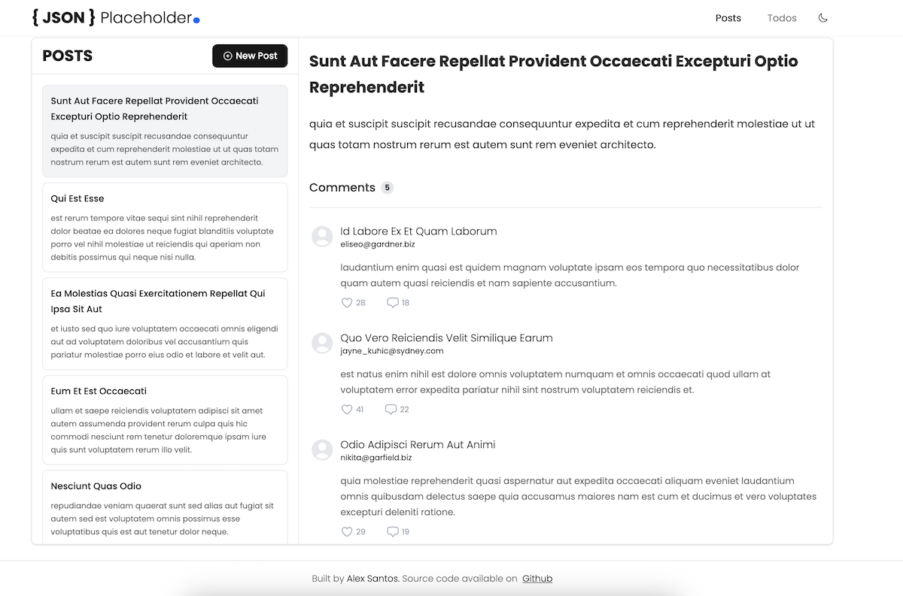
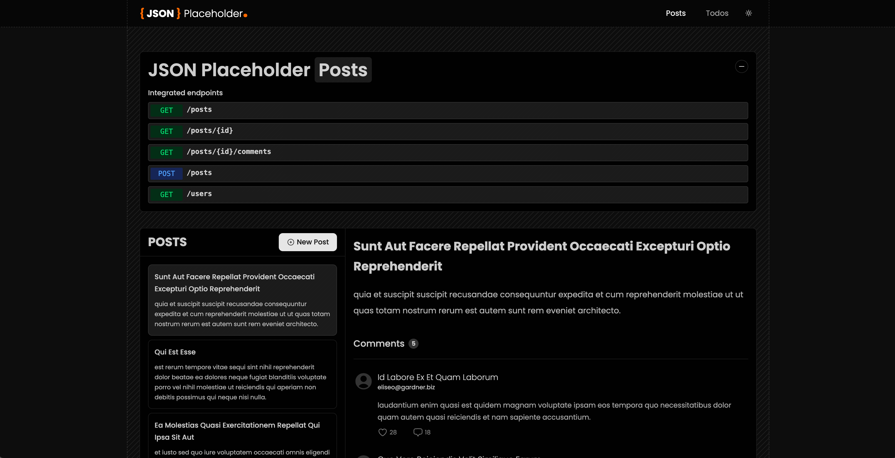
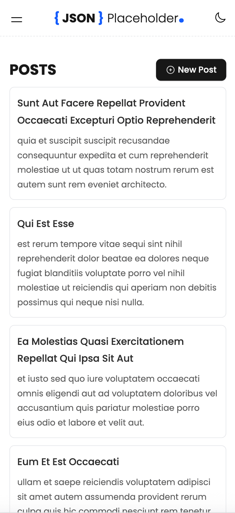
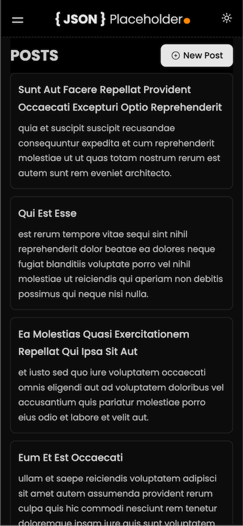

# JSONPlaceholder API Test

[](https://vitejs.dev/)
[](https://react.dev/)
[](https://www.typescriptlang.org/)
[](https://axios-http.com/)
[](https://tanstack.com/query/latest)
[](https://reactrouter.com/)
[](https://tailwindcss.com/)
[](https://testing-library.com/)
[](https://storybook.js.org/)

---

## 📌 Overview

This project is a modern, scalable example of working with remote APIs using **React**, **TypeScript**, and **React Query**. It integrates **JSONPlaceholder** as a data source and showcases best practices in component architecture, testing, and UI development with **Tailwind CSS**.

---

## 🖼️ Screenshots

### Desktop




### Mobile




---

## ✨ Key Highlights

### ⚙️ Data Fetching & API Integration

- Uses [JSONPlaceholder](https://jsonplaceholder.typicode.com/) for mock REST API.
- API requests handled by a custom-configured **Axios** instance.
- Efficient server state management via **React Query**.
- Graceful error and loading state handling.

### 💻 Developer Experience

- Fast dev environment with **Vite**.
- Component documentation and UI testing with **Storybook**.
- Unit and integration testing using **Jest** and **React Testing Library**.
- Fully responsive UI built with **Tailwind CSS**.

### 🧼 Code Quality

- **TypeScript** for static typing and safer code.
- **Prettier** for consistent formatting.
- **ESLint** with custom rules for code hygiene.
- **Husky** hooks for pre-commit/push checks:

  - Linting
  - Type checks
  - Tests
  - Auto-formatting

### 🧱 Architecture

- Follows **Atomic Design** for component hierarchy.
- Modular and maintainable codebase.
- Uses **custom hooks** for reusable logic.
- Context-based state management (e.g., theme).

---

## 🚀 Technologies

- Vite
- React
- TypeScript
- Axios
- React Query
- React Router
- Tailwind CSS
- Jest + React Testing Library
- Storybook
- ESLint + Prettier
- Husky (Git hooks)

---

## 📋 Features

- API communication with error/loading state UI.
- Light/dark mode toggle using Context API.
- Reusable Axios setup.
- Modular, component-based design.
- Fully responsive UI.

---

## 🛠 Getting Started

### ✅ Prerequisites

- Node.js `v18+`
- npm or yarn

### ⚡ Setup

```bash
# Clone repo
git clone https://github.com/alexsantosquispe/jsonplaceholder-api-test.git
cd jsonplaceholder-api-test

# Install dependencies
npm install

# Run development server
npm run dev
```

Visit `http://localhost:5173` to view the app.

---

## 🦾 Project Structure

```
├── src/
│   ├── assets/         # Static assets
│   ├── components/     # UI components (Atomic Design)
│   │   ├── atoms/
│   │   ├── molecules/
│   │   └── organisms/
│   ├── context/        # Theme context, global state
│   ├── hooks/          # Reusable custom hooks
│   ├── icons/          # SVG and icon components
│   ├── services/       # Axios config, API calls
│   └── types/          # TypeScript types
│
├── .storybook/         # Storybook config
├── .husky/             # Git hooks
├── .vscode/            # Editor config
├── Configuration Files
│   ├── tsconfig.*.json
│   ├── jest.config.ts
│   ├── vite.config.ts
│   ├── tailwind.config.js
│   ├── .eslintrc.cjs
│   └── .prettierrc
```

---

## 🧠 Design & Best Practices

### 📆 Component Architecture (Atomic Design)

- **atoms/**: Fundamental UI elements
- **molecules/**: Combinations of atoms
- **organisms/**: Complex, self-contained sections (e.g., `Posts`, `Todos`)

### 🧹 Custom Hooks

- Fetching data
- UI interactions
- Utility functions

### 🛡 API & Services

- Centralized API clients
- Typed endpoints
- Error handling utilities

### 🧪 Testing & Docs

- `*.test.tsx` for unit/integration tests
- `*.stories.tsx` for Storybook previews
- Fully automated with Jest & Testing Library

---

## 📁 Component File Pattern

```
components/
└── ComponentName/
    ├── ComponentName.tsx         # Component logic
    ├── ComponentName.test.tsx    # Unit test
    └── ComponentName.stories.ts  # Storybook preview
```
